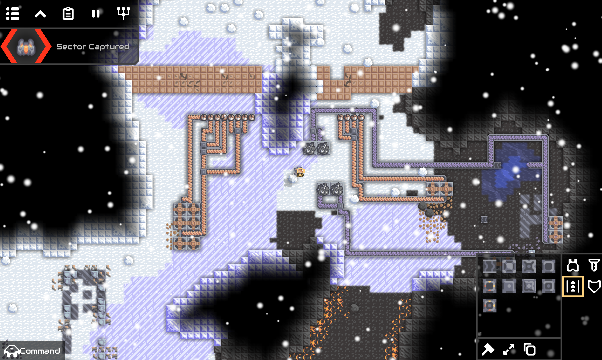
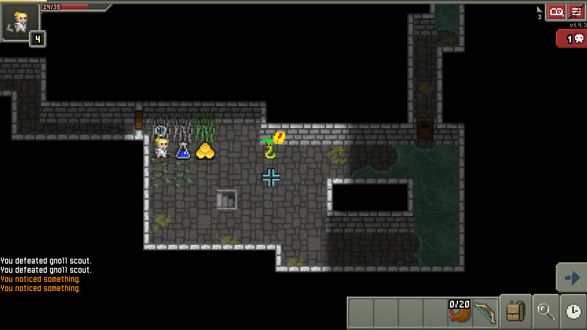

# Ports
"Porting" a LibGDX project to work with SwitchGDX would ideally entail simply adding
the corresponding Gradle subproject, but in practice often requires some amount of work
to remove/adapt code snippets using unsupported runtime features or updating/upstreaming
the runtime library with the needed features. This usually takes the form of taking missing
features from OpenJDK sources and replacing internal API usages with simplified versions. 
These ports of open source LibGDX games are primarily for testing and finding missing runtime
features to support.

## [Mindustry](https://github.com/TheLogicMaster/Mindustry-SwitchGDX)

The SwitchGDX backend had to be completely ported to Mindustry's LibGDX fork, 
[Arc](https://github.com/TheLogicMaster/Arc-SwitchGDX). Controller support
was partially implemented, but a touch screen/mouse is still completely required.

## [Pixel Wheels](https://github.com/TheLogicMaster/pixelwheels-switchgdx)

Required commenting out openUri workaround, file path fixes, removing logging Printer usage, UI tweaks, 
switch from Gson to LibGDX JSON serialization, un-thread audio, replace Scanner usage, and disable a
broken localization language.

## [Shattered Pixel Dungeon](https://github.com/TheLogicMaster/shattered-pixel-dungeon-switchgdx)

Required commenting out bits using GregorianCalendar and adding a small Shattered Pixel specific platform implementation.

## [A Square Astray](https://github.com/TheLogicMaster/A-Square-Astray-SwitchGDX)

Required updating LibGDX and a few audio changes to work around the one music limitation.

## [TriPeaks](https://github.com/TheLogicMaster/tripeaks-switchgdx)

Just required updating Gradle and LibGDX.

## [Unlucky](https://github.com/TheLogicMaster/Unlucky-SwitchGDX)

Required updating LibGDX and disabling OpenGL profiling code.

## [Agile](https://github.com/TheLogicMaster/Agile-SwitchGDX)

(Not finished)
The platform specific API had to implemented for threading, dialogs, audio sample playing, and file operations.

## [Pepper and Carrot Running Game](https://github.com/TheLogicMaster/PepperAndCarrotRunningGame-SwitchGDX)

Works out of the box, with controller enhancements added.

## [Bomberman](https://github.com/TheLogicMaster/Bomberman-SwitchGDX)

Required updating LibGDX, and controller support was added.

## [Burger Party](https://github.com/TheLogicMaster/BurgerParty-SwitchGDX)

Required only updating LibGDX and a few fixes for breaking changes.

## [Planet Generator](https://github.com/TheLogicMaster/Planet-Generator-SwitchGDX)

Required commenting out test code and adding a workaround for a floating point bug.

## [Jewel Thief](https://github.com/TheLogicMaster/jewelthief-switchgdx)

Required implementing high-score functionality and added controller support.

## [nO mooRe](https://github.com/TheLogicMaster/nomoore-switchgdx)

Required updating LibGDX.

## [Arithmetic Run](https://github.com/TheLogicMaster/arithmetic-run-switchgdx)

Required updating LibGDX, translated a few strings to English.

## [Tangler](https://github.com/TheLogicMaster/Tangler-SwitchGDX)

Works out of the box.

## [Xodus](https://github.com/TheLogicMaster/Xodus-SwitchGDX)

Works out of the box.

## [Rect Ball](https://github.com/TheLogicMaster/Rect-Ball-SwitchGDX)

Works out of the box.

## [Klooni 1010](https://github.com/TheLogicMaster/Klooni1010-SwitchGDX)

Just required updating LibGDX and the Gradle wrapper.

## [Dark Matter](https://github.com/TheLogicMaster/DarkMatter-SwitchGDX)

Required updating LibGDX and extensive runtime work to support Kotlin Coroutines for async asset loading.

## [Mystic Garden](https://github.com/TheLogicMaster/MysticGarden-SwitchGDX)

Required only updating the Gradle wrapper.
