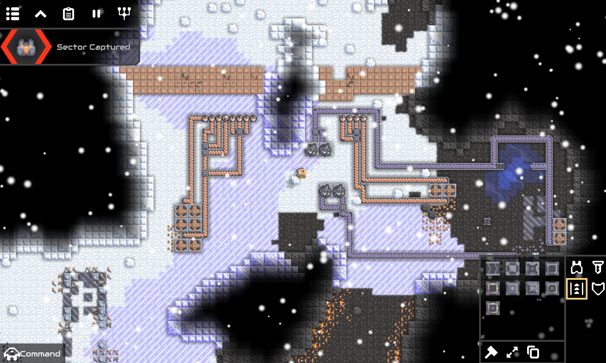
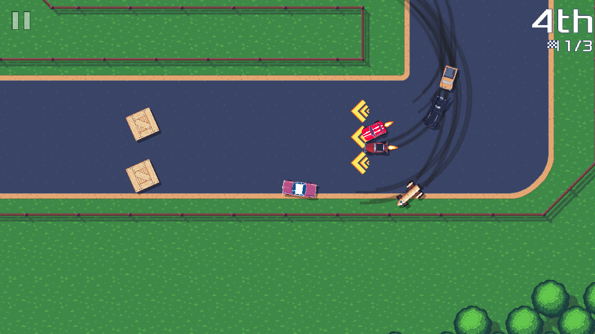
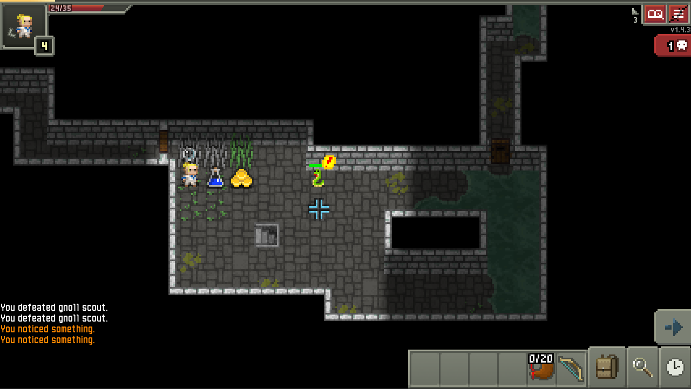

# SwitchGDX
[](https://jitpack.io/#com.thelogicmaster/switch-gdx)

## About
This is a Nintendo Switch Homebrew and Xbox UWP backend for the [LibGDX](https://libgdx.com) game framework. It uses
the [Clearwing VM](https://github.com/TheLogicMaster/clearwing-vm) project to transpile Java to C++ along with custom
native bindings for LibGDX. It supports Nintendo Switch Homebrew builds using LibNX, and Xbox/Windows Store with UWP.
See the SwitchGDX [thread](https://discord.com/channels/348229412858101762/965372515285352468) on the LibGDX Discord 
server for support.

## Ports
See [Ports](PORTS.md) for a list of current ports.

**Mindustry, Pixel Wheels, and Shattered Pixel Dungeon Ports**




## Features
- Full GDX Reflection support
- GDX Controllers support for all Switch controller layouts
- GDX Preferences for persistent data
- Desktop builds for debugging with emulated controller inputs
- Xbox UWP builds

## Compatibility
The majority of LibGDX is fully supported. A few features such as GL30 and audio recording are currently unsupported.

## Extensions
FreeType, Controllers, Box2D, Bullet are supported.

## JVM Languages
Since Clearwing takes Bytecode as an input, it can support any JVM language. The main limitation would be the Clearwing
runtime library, which is limited and may not support all required functionality, though this can typically be easily
added as needed. Java and Kotlin have been tested and work.

## Libraries
Pure Java libraries should work without any extra work, assuming they don't use unsupported runtime library features or
JNI. Libraries compiled with newer Java versions could also pose an issue. If a library uses JNI, custom native
bindings could be provided and things should just work, the shared library loading API has no effect. See
[Libraries](LIBRARIES.md) for a list of tested libraries.

## Todo
- Multithreaded AssetManager support
- Switch-specific API (Controller remapping)
- Controller analog trigger support, remapping API, rumble
- I18N non-simple
- Sound effect pitch control
- GL30
- Set main thread exception handler to show error dialog
- Fix sockets
- VSCode project support
- Keyboard input support
- Mac OS support
- Fix second launch crash on Switch (Probably cleanup issue)

## Limitations
See the [Clearwing](https://github.com/TheLogicMaster/clearwing-vm) documentation for the limitations inherent to the "VM"
- Only one Music instance can play at a time
- Sound effects are limited to OGG and WAV, Music supports MP3, OGG, and WAV
- Unused classes are optimized out, use the `reflective` `switch.json` config option to prevent it for specific classes for reflection
- Socket server only supports IPv4 (Not supported at all at present)

## Installation
In addition to the C++ dependencies, JDK 17 is required. Rsync is used for incremental compilation, and CMake is used
for building the generated C++ project.

### Linux/Mac
- Install CMake, Ninja, Rsync, Texinfo, SDL2, SDL2_Mixer, GLEW, zlib, Freetype, curl
- With APT: `sudo apt install build-essential texinfo rsync cmake ninja-build libsdl2-mixer-dev zlib1g-dev libglew-dev libfreetype-dev libcurl4-gnutls-dev libzzip-dev`
- With Homebrew: `brew install sdl2 sdl2_mixer libffi curl libzzip freetype cmake pkgconf`
- Install [devkitPro pacman](https://github.com/devkitPro/pacman/releases/tag/v1.0.2)
- `dkp-pacman -S switch-zlib switch-libvorbis switch-zziplib switch-sdl2 switch-sdl2_mixer switch-freetype switch-glad switch-curl switch-bulletphysics dkp-toolchain-vars`

### Windows
- Ensure the project directory is as close to the filesystem root as possible to avoid Windows path limits (In 2025...)
- Install MSYS2
- Open a mingw64 shell: `C:\msys64\msys2_shell.cmd -mingw64`
- Install dependencies: `pacman -S gcc git rsync texinfo mingw-w64-x86_64-cmake mingw-w64-x86_64-zziplib mingw-w64-x86_64-glew mingw-w64-x86_64-SDL2_mixer mingw-w64-x86_64-freetype mingw-w64-x86_64-bullet`
- Install [devkitPro Updater](https://github.com/devkitPro/installer/releases/latest) with Switch packages selected (Leave downloaded files)
- Open DevKitPro's MSYS2: `C:\devkitPro\msys2\msys2_shell.cmd -mingw64`
- Install dependencies: `pacman -S switch-zlib switch-zziplib switch-sdl2_mixer switch-libvorbis switch-freetype switch-glad switch-curl dkp-toolchain-vars texinfo`
- Build LibFFI for Switch

### Libffi
This is a library that has to be compiled and installed manually for Switch. Run this for Linux normally and on Windows under MSYS2. Ensure that the working directory doesn't contain any spaces.
``` shell
git clone https://github.com/libffi/libffi.git
cd libffi
./autogen.sh
source $DEVKITPRO/switchvars.sh
source $DEVKITPRO/devkita64.sh
CFLAGS="-g -O2 -march=armv8-a -mtune=cortex-a57 -mtp=soft -fPIC -ftls-model=local-exec" CHOST=aarch64-none-elf ./configure --prefix="$DEVKITPRO/portlibs/switch" --host=aarch64-none-elf
make
sudo cp ./aarch64-none-elf/include/*.h $DEVKITPRO/portlibs/switch/include/
sudo cp ./aarch64-none-elf/.libs/libffi.a $DEVKITPRO/portlibs/switch/lib
sudo cp ./aarch64-none-elf/.libs/libffi.la $DEVKITPRO/portlibs/switch/lib
sudo cp ./aarch64-none-elf/libffi.pc $DEVKITPRO/portlibs/switch/lib/pkgconfig/
```

### UWP
- Follow `Windows` steps above
- Install CMake for Windows
- Install Visual Studio 2022 and C++/UWP support (`Desktop development with C++`, `Windows application development`)
- Run twice (Rebuild) for DLLs and assets to properly be copied for some reason

## Project Setup
For reference, there's an `example` project provided with the needed Gradle config to build a SwitchGDX project. If you
are creating a new LibGDX project, there's a fork of the project builder, [gdx-liftoff](https://github.com/tommyettinger/gdx-liftoff), 
with the SwitchGDX backend [here](https://github.com/TheLogicMaster/gdx-liftoff). Just enable the Switch backend, and it
will take care of the rest. To add SwitchGDX to an existing project, a new Gradle subproject needs to be created, 
adding the `switch` directory with the icon, `switch.json` config file, `build.gradle` file, and the actual `src`
directory with the `SwitchLauncher` source class. The module needs to be added to `settings.gradle`, and the 
`clearwingVersion` and `switchGdxVersion` properties need to be set in either `gradle.properties` or the top level 
`build.gradle`, depending on the project layout. The switch `build.gradle` can be mostly copy-pasted, changing only
the title and author variables and the asset copy paths, if not in `core/assets`. Any source paths to be used with the
jnigen style native code inlining also needs to be added to the transpiler arguments in `switch/build.gradle`. As far
as [libraries](LIBRARIES.md) are concerned, if they require using GDX reflection, then those classes need to be added
to the `switch.json` `reflective` class pattern list. The list of verified libraries details the needed config 
entries. To enable the Ryujinx emulator, download/install it then set `ryujinxPath` in the `local.properties` file 
(Create if needed). Make sure Java Home points to Java 17 or select a Java 17 JDK as the Gradle JDK in Intellij build 
settings. Ensure that the project itself compiles with the Java 8 language level. 

## Usage
All the main tasks are present in the `switchgdx` Gradle group in the `switch` submodule. The first time transpiling
will be quite long, but subsequent runs will be comparatively snappy. Incremental compilation is achieved here by
transpiling into one directory then using rsync to only copy the changed files into the final C++ project directory.
- __transpile__: Run the transpiler and generate the C++ project
- __run__: Transpile, then run the C++ project in desktop-mode with emulated controller inputs (Yuzu layout)
- __nro__: Transpile, then build a Nintendo Switch Homebrew NRO executable
- __deploy__: Build NRO, then deploy to a Switch over LAN using NxLink
- __ryujinx__: Build NRO, then run in Ryujinx emulator
- __uwp__: Transpile, then open UWP project in Visual Studio

### Deploying to Switch
Ensure that the Homebrew Launcher is opened to the NetLoader before running the deploy task. By default, it tries
pinging the Switch to find it, but manually specifying the IP in the nxlink command may be necessary depending on the 
network.

### UWP
The UWP task opens Visual Studio, where the project settings need to be adjusted for the signing certificate and remote 
deployment options for running on an Xbox console in devkit mode. Running a debug build should be as simple as building
the project and running it. There's a bug where the UWP project needs to be manually rebuilt to for the assets to be 
copied over into the UWP build directory. The first time 
the task is run will be quite slow, as it needs to install the VCPKG dependencies. Currently,
for Release builds to link successfully, the debug runtime library (/MDd) needs to be used. 

## Debugging
The project can be debugged as a normal C++ project with your IDE of choice. CLion works out of the box with
the CMake project. Simply run one of the Gradle tasks to transpile the project, then
open the `<project>/switch/build/<project>` directory with CLion as a CMake project. A Run configuration should be automatically created. 
Set the working directory in the run config to the `switch/build/<project>` project directory so that assets
can be properly loaded at runtime. To trace back a native crash, simply press the debug icon next to the run
configuration, and it should jump right to the exception and show the native stack trace. By inspecting the
generated code and call stack, null fields can be found and traced back to Java source code by looking at the
`LINE_NUMBER` line numbers. Code changes may lead to additional classes being included by the transpiler, in which case
the CLion CMake project needs to be reloaded using `Tools/Cmake/Reload CMake Project` or it won't compile.
If using Windows, the MinGW toolchain has to be selected under the project build settings. To debug a Java
Exception being thrown, setting a breakpoint at the throw statement can be quite useful. If it's a place you can't
easily add print-lines like a library, `printf` combined with `stringToNative` can also be helpful to print out a
Java string, potentially obtained from `Object#toString`. In CLion, `stringToNative` can also be evaluated while
debugging, which is often extremely useful for dynamically inspecting values without recompiling.
### Windows
On Windows, if you change the working directory in CLion, it doesn't seem to find the required shared libraries, so
manually copying the DLLs from `C:\msys64\mingw64\bin` into the executable directory may be necessary. Adding
the directory to the `Path` doesn't seem to be sufficient.

## Test Suite
The `tests` module is for running the GDX test suite and verifying GDX functionality. See [Tests](TESTS.md) for working
features. Building the test module requires building the tests module JAR in the libgdx repo and putting it in 
`tests/libs`, in addition to the lwjgl3 test module JAR for the required assets. The `tests` module is disabled if the 
`tests/libs` directory doesn't exist to not break JitPack builds and such.

## Notes
- Concurrent access to files is more limited on Switch where it might normally work on PC, so ensure files are closed properly
- For Switch, all threads need to be joined manually, or it will crash on exit or when ran a second time. Any program 
threads must be manually stopped/joined on dispose.
- If using SNAPSHOT Gradle dependency (Not recommended), refresh Gradle dependencies using the Intellij Gradle menu to not use cached versions and update to the latest.
- The UWP project generation has a bug where the project has to be manually rebuilt in Visual Studio for the assets to be properly copied
- When using Joycons individually, the inputs will be rotated horizontally. Controllers must be remapped from the home menu for now. 
- `Controllers#getCurrentController` returns a controller representing all controller input, rather than the last controller.
